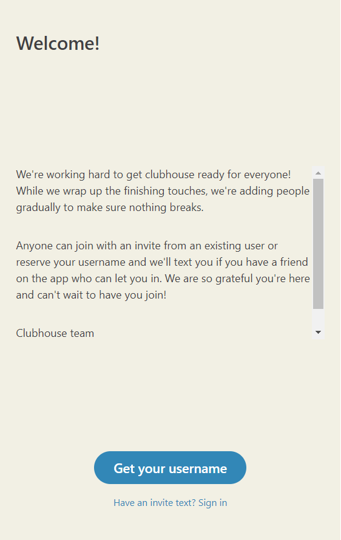
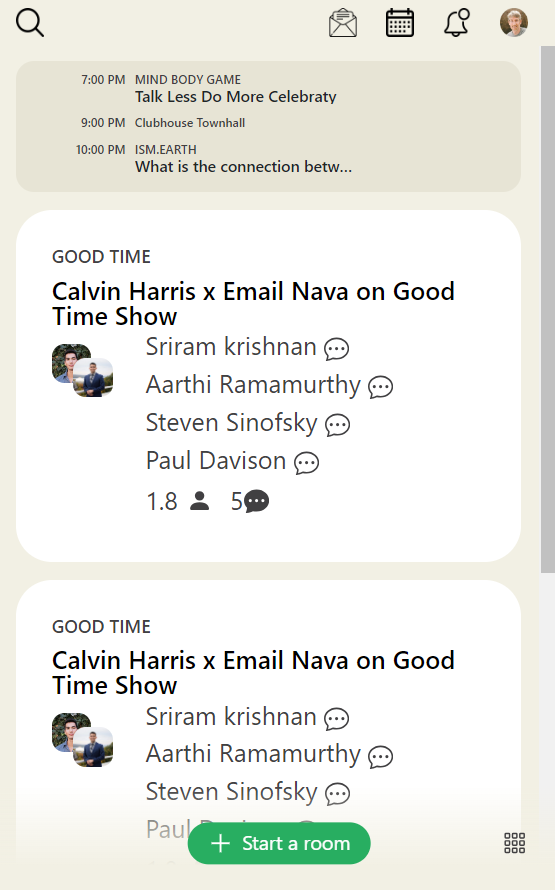
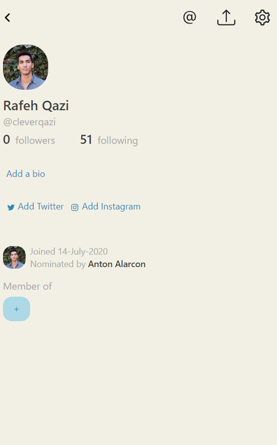

# Clubhouse-Clone

A web Application that Replicates the Clubhouse App.

This project is a web application that replicates the features of Clubhouse using HTML, CSS, JavaScript, and json to create a user-friendly interface that allows the user to join or create audio rooms chat with other users, and more. 

<center>
    
</center>

<center>
    
</center>

<center>
    
</center>

## Tech-Stack

- React
- HTML
- CSS
- Firebase
- Redux
- Styled-Components

## Features

- The application has the layout and style of Clubhouse.
- The application allows the user enter a room, explore, access profile page and many more.

## Installation and Usage

To install and run this project, you need to have Nodejs installed on your computer.

To download the code for this project, you can clone this GitHub repository using the following command:

```git clone https://github.com/Amritha-07/Clubhouse-Clone.git```

To build Dependencies

```npm install```

or 

```npm run build```

To start the application

```npm start```

## References

- [Build Clubhouse with React JS & Styled Components](https://www.youtube.com/watch?v=cuR9R1Hj1Ug) from Clever Programmer